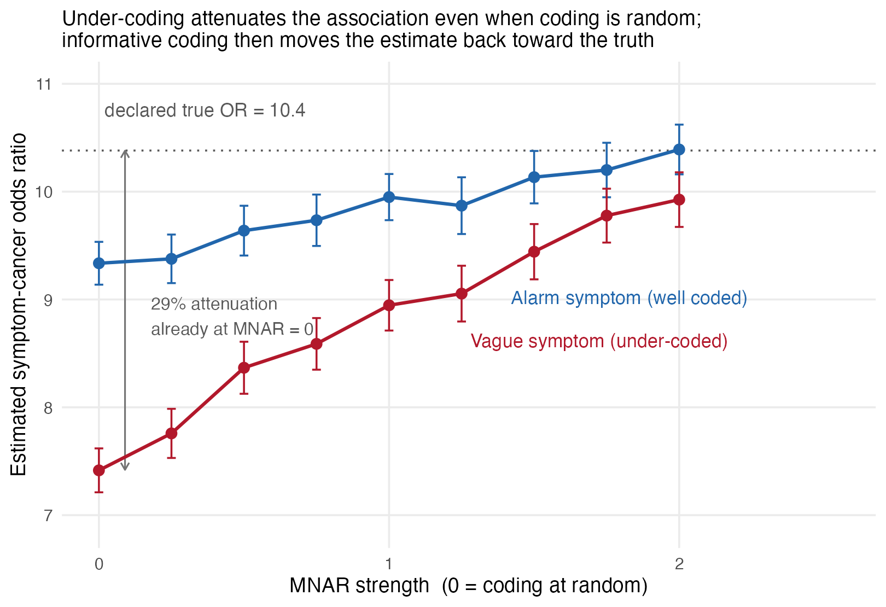
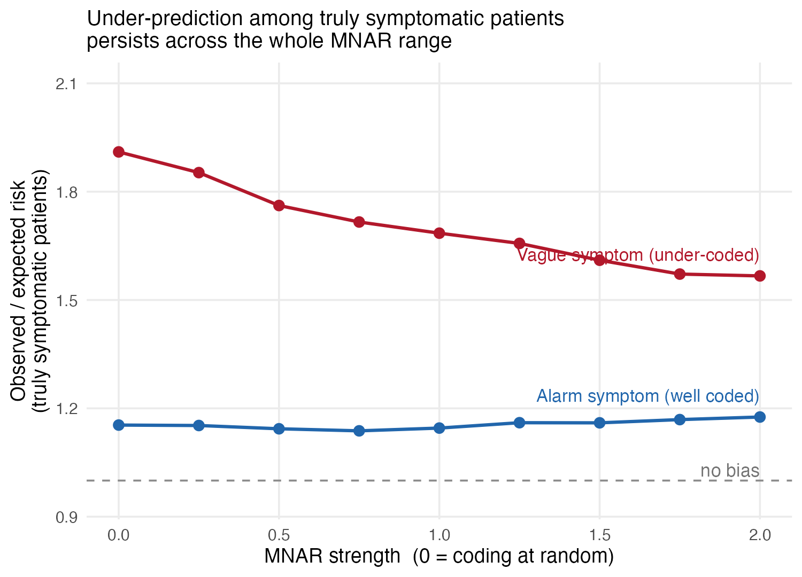

# Symptom under-recording and cancer risk prediction: a small simulation

If a symptom is present in a consultation but never entered as a structured code,
a prediction model reads it as absent. This repository contains a minimal,
fully-declared simulation of what that does to a QCancer-style two-year cancer
risk model, and to the number of truly symptomatic patients whose predicted risk
falls below the NICE NG12 3% referral threshold.

It accompanies a DPhil proposal on incomplete symptom recording in UK primary
care. It is a mechanism demonstration, not a study: no real patient data are used
and every parameter is declared, none estimated.

## What the simulation does

```
U  unobserved severity / clinical suspicion
S  symptom truly present
R  symptom recorded          <- depends on U when mnar_strength > 0
S* observed structured code  =  S AND R
Y  cancer within two years   <- depends on S and U, never on R
```

`Y` does not depend on `R`. So any difference between a model fitted on `S*` and
one fitted on `S` is produced entirely by the recording process. Two coding
regimes are contrasted: an alarm symptom coded 85% of the time when present
(rectal bleeding), and a vague symptom coded 45% of the time (fatigue).

The coding intercept is solved numerically at each grid point so that the
*marginal* coding rate stays fixed as `mnar_strength` rises. This matters: since
`plogis(a + m*U)` does not average to `plogis(a)` once `m > 0`, setting the
intercept naively would let coding frequency drift along the x-axis and confound
the two mechanisms the simulation exists to separate.

## Reproducing

Base R only, no packages required for the simulation (`ggplot2` for the plots).

```r
source("R/simulate_recording_bias.R")
alarm <- run_sweep(base_coding_prob = 0.85, nsim = 200)   # ~30s
vague <- run_sweep(base_coding_prob = 0.45, nsim = 200)
```

`run_sweep()` returns Monte Carlo standard errors alongside every estimate, so
you can check whether `nsim` is adequate instead of taking it on trust.
`figures/sweep_results.csv` is the output of the exact call above with
`seed = 20260726`. `tests/test_simulation.R` checks the thirteen invariants that make the
result interpretable, including that coding frequency stays fixed along the
sweep.

## Results





Three things come out of this, and the first was not what I expected.

**1. Attenuation appears before recording is informative at all.** At
`mnar_strength = 0` (coding completely at random), the vague-symptom regime
already returns an odds ratio of 7.42 against a declared true value of 10.38, a
29% attenuation. The alarm regime returns 9.34, a 10% attenuation. Coding a
symptom less often biases the estimate downwards on its own, with no informative
missingness required.

The two mechanisms turn out to be comparable in size; neither dominates. The
gap between regimes at `mnar_strength = 0` is 1.92 OR units; sweeping
`mnar_strength` from 0 to 2 moves the vague regime by 2.46 units and the alarm
regime by 1.21. So coding frequency sets where the estimate starts, and
informativeness determines how far it then travels. It travels furthest where
coding is sparsest.

This matters for how the problem should be framed. It is a sensitivity problem:
some truly present symptoms never become codes, specificity stays near one
because clinicians rarely code a symptom that was not there, and the resulting
one-directional misclassification pulls the coefficient toward the null. That is
a measurement-error problem, not a missing-data problem. There is no missing
cell to impute, because an uncoded symptom and an absent symptom are the same
zero in the structured field.

**2. Increasing MNAR strength moves the odds ratio back *toward* the declared
truth.** As coding concentrates among patients whose severity is high, being
coded becomes a sharper marker of genuine disease, so the estimated association
strengthens: 7.42 to 9.87 in the vague regime, with coding frequency held fixed.
Informative recording changes what the coded variable means; it does not simply
make the bias worse. Recovering the odds ratio is not the same as recovering
usable predictions, though: the second figure shows calibration for truly
symptomatic patients stays poor throughout.

**3. Under-prediction for truly symptomatic patients persists across the whole
range.** Observed risk exceeds predicted risk by 61–91% in the vague regime and
by 9–15% in the alarm regime, at every MNAR level tested. The
observed/expected ratio never approaches 1. This is the quantity with clinical
consequences, and it is worst exactly where coding is weakest.

## Limits worth stating plainly

- **This is not a reproduction of Figure 2 in the submitted proposal.** It is an
  independent implementation of the same mechanism, written from the description
  rather than from the original code, so the numbers do not match. One direction
  differs: the proposal's Figure 2A shows the share of patients falling below the
  referral threshold *rising* with MNAR strength for vague symptoms, whereas here
  under-prediction *eases* slightly as MNAR strength rises (finding 2 above).
  The two are reconcilable (they report different quantities, and the threshold
  measure depends on where the risk distribution sits relative to 3%), but the
  discrepancy is real and I would rather flag it than paper over it.
- **`log_or_symptom = 2.34` (OR ≈ 10.4) is a declared parameter, not an estimate
  from any published study.** It is set to the order of magnitude reported for
  strong alarm symptoms so that attenuation is visible on the plot. Nothing in
  the qualitative result depends on the specific value; change it and re-run.
- The generative model is deliberately crude: one binary symptom, one unobserved
  severity variable, one covariate, no competing risks, no practice-level
  clustering, no calendar time. Adding practice-level variation in coding
  propensity is the obvious next step, and is the analysis the proposal actually
  turns on.
- A simulation cannot establish that recording bias matters in CPRD. It can only
  show what would follow if recording behaves this way, and identify which
  quantity is worth measuring first.

## Licence

MIT.
